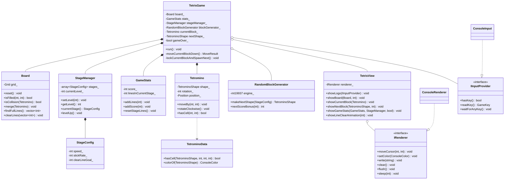

# Tetris OOP Class Diagram

## Design notes for the OOP assignment

- `TetrisGame` controls the overall game flow, while `Board`, `Tetromino`, `GameStats`, and `StageManager` each manage one clear part of the game state.
- Member variables are kept private, and each class exposes only the methods needed by the rest of the program.
- `IRenderer` and `IInputProvider` remain as simple interface examples for inheritance and polymorphism. `ConsoleRenderer` and `ConsoleInput` provide the Windows console implementations.
- `RandomBlockGenerator` is a normal helper class instead of a separate interface, which keeps the project easier to explain at an undergraduate OOP assignment level.
- `Board` exposes `isFilled(row, col)` instead of exposing its full internal grid to the view.
- Full-line handling is split into `findFullLines()` and `clearLines()` so `TetrisGame` can show the line-clear animation before removing lines.
- The project is intentionally Windows-console-only. Platform-specific input and rendering code uses `conio.h`, `Windows.h`, `_kbhit()`, `_getch()`, `SetConsoleCursorPosition()`, and `SetConsoleTextAttribute()` inside `ConsoleInput` and `ConsoleRenderer`.
