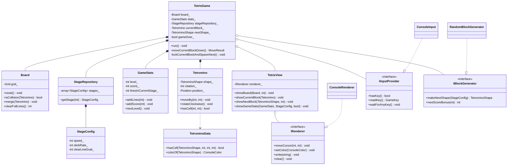

# Tetris OOP Class Diagram

## Reuse-focused design notes

- `IRenderer`, `IInputProvider`, and `IBlockGenerator` are pure abstract interfaces, so console rendering, input, and block generation can be replaced in another project without changing `TetrisGame`.
- `Board`, `Tetromino`, `GameStats`, and `StageRepository` each own a single responsibility and keep data private behind focused public methods.
- `TetrisGame` composes reusable components instead of depending on global variables.
- Gameplay constants are centralized in `GameConstants.h` to remove hard-coded magic numbers from the core logic.
